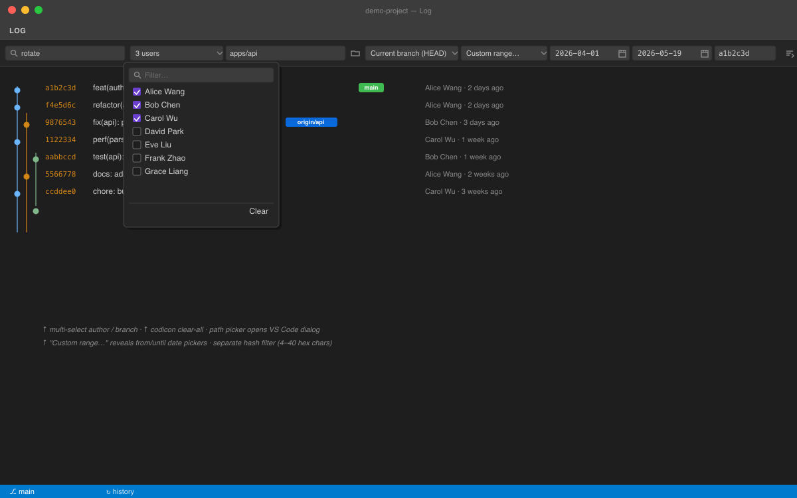
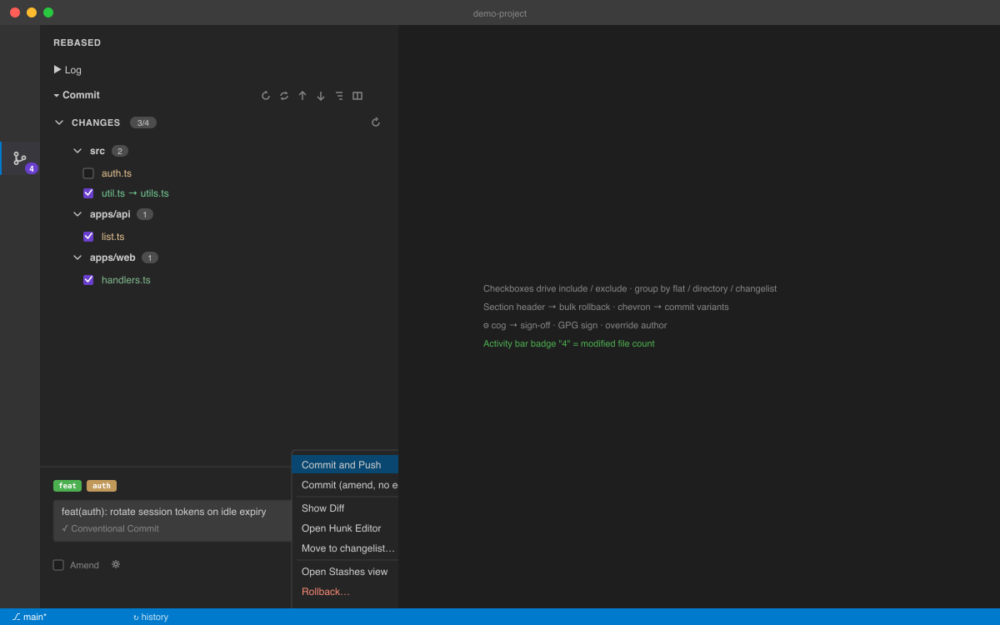

# Rebased

**English** · [简体中文](README.zh-CN.md)

> JetBrains-style git client features for VS Code.
> Drag-drop interactive rebase, log graph, hunk staging, changelists, local history.

[](https://github.com/funchs/vscode-rebased/actions/workflows/ci.yml)
[](#testing)
[](LICENSE)
[](https://code.visualstudio.com/)
[](https://open-vsx.org/extension/funchs/vscode-rebased)

Inspired by [DetachHead/rebased](https://github.com/DetachHead/rebased) — the
IntelliJ git client extracted as a standalone app. This extension distills its
best ideas into a single VS Code extension that coexists with the built-in git
support and GitLens.


## See it in action


---

## Highlights

### Drag-and-drop interactive rebase

Open any `git-rebase-todo` (e.g. `GIT_SEQUENCE_EDITOR="code --wait" git rebase -i HEAD~5`)
to get a webview with drag-to-reorder rows, single-click action cycling
(pick → reword → edit → squash → fixup → drop), and ⌘⏎ to save and continue.


### Log graph with virtual scrolling

Branch-aware swim-lane graph, refs as colored chips, virtual scrolling for
10,000+ commits. The sticky filter toolbar matches IntelliJ's git log:
**subject** text search, **author** multi-select (loaded from `git shortlog`,
filterable in a popover), **path** with a Browse… button that opens VS Code's
native file dialog, **branch** multi-select with a "Current branch (HEAD)"
sentinel, **date** presets + a Custom range… mode that reveals from/until
date pickers, and a separate **commit hash** input (because git's `--grep`
doesn't match SHAs). All controls use codicons and standard VS Code input
styling.



### Commit view — checkbox staging, group-by, single-button + chevron variants

The Commit panel is a VS Code-native rework of IntelliJ's commit dialog:

- **Unified Changes list** with per-file checkboxes (replaces the old
  Staged + Changes two-pane). Indeterminate state for partially-staged files.
- **Group by** toggle in the view title bar — Flat / By directory / By
  changelist (uses the project's changelist data so files moved between
  changelists immediately reflect).
- **Section header bulk rollback** — `↺` button right-aligned next to the
  `CHANGES n/m` count; rolls back selected files if any, otherwise all.
- **Multi-select** — Cmd/Ctrl-click toggles, Shift-click range-selects,
  Cmd+A selects all visible, Delete rolls back selected.
- **Single primary button + chevron menu** — `Commit` + dropdown for
  `Commit and Push`, `Commit (amend, no edit)`, `Show Diff`, `Open Hunk
  Editor`, `Move to changelist…`, `Open Stashes view`, `Rollback…`.
- **Commit options cog** — popover with Sign-off (`--signoff`), GPG sign
  (`-S`), Override author (`--author=...`).
- **Activity-bar badge** — Rebased icon shows the number of locally
  modified files (queried via `getStatus`, refreshed on every repo change).

Conventional Commits live validation chips, status indicator, and the
existing Wizard… shortcut all carry over.



### Commit details side panel

Click any commit in the log to open a side panel with subject, body, refs,
parents, and a clickable file list (+ / − stats) that diffs each file against
its parent via VS Code's built-in diff editor.


### Hunk-level staging

Stage partial changes per file with checkboxes — backed by `git apply --cached`
on a minimal patch built from your selection.

### Conventional Commits live validator

Real-time type/scope/BREAKING chips above the commit textarea, status row
showing ✓ valid / ⚠ warnings / ✕ format error. Or run the 5-step **Commit
Wizard** (⌘⌥C) — scope autocomplete from your repo's history.


### Full-file blame gutter

Press <kbd>⌘⌥B</kbd> to toggle. Each line shows commit hash · author · age in a left
gutter; runs from the same commit collapse so only the first row is annotated.
Hover an annotation for the commit message + a one-click "Show commit" link.


### Local history

Every file save auto-snapshots into `globalStorage`. Browse, diff against
current, or restore — independent of git, so even uncommitted work is
recoverable.


### Conflict resolution panel

When you hit conflicts (merge / rebase / stash-pop / orphan-unmerged), a
JetBrains-style panel lists every conflicted file with per-file actions —
*Accept yours* (--ours), *Accept theirs* (--theirs), *Merge…* (3-way merge editor), *Reset*. Bottom bar carries a state-aware finalize button (Mark resolved / Continue rebase / Drop stash).


### Changelists

JetBrains-style named groups of working-tree paths. Group fix-up changes,
commit them as one without touching unrelated edits.


### Branches view with direct right-click actions

The sidebar **Branches** tree groups local + remote branches and exposes every
action JetBrains pops into its branches popup — directly on each row, no
intermediate quick-pick. Click a branch to open the Log panel filtered to
that branch (single- or double-click per `workbench.list.openMode`).

Per-type context menus:

- **Current branch** — New Branch from Here · Rename · Push (set upstream) ·
  Force Push (with-lease) · Copy Name
- **Local non-current** — Checkout · Merge into Current · Rebase Current onto This ·
  Compare with Current · New from Here · Rename · Push (set upstream) · Force Push ·
  Copy Name · Reset Current to Here · Delete
- **Remote** (`origin/…`) — Checkout · Merge · Rebase onto · Compare · New from Here ·
  Fetch This Branch · Copy Name · Reset Current to Here · Delete on Remote

Destructive actions (Force Push, Reset Hard, Delete on Remote) gate behind a
modal confirmation; merge / rebase auto-offer "Stash and retry" on a dirty
working tree.


### Status bar that follows the operation

Color and content adapt to the current state — clean (blue), dirty
(blue with changelist label), or conflict (red with file count).
Click to create a branch.


### Submodule view

Per-submodule status mapped from `git submodule status` prefix: in-sync,
out-of-sync, not-initialized, merge-conflict. Title-bar actions for
init / update / sync.


---

## Full feature list

| Area | Feature |
|---|---|
| **Rebase** | Drag-drop editor · ⌘⏎ save · auto-stash on dirty tree |
| **Log** | Graph · virtual scroll · IntelliJ-style filter (author multi-select · branch multi-select · path picker · custom date range · commit hash) · refs · context menu |
| **Commit** | Checkbox staging · group by flat/dir/changelist · multi-select rollback · Commit + chevron variants · sign-off / GPG / author override · CC validator · wizard · activity-bar badge |
| **Branches** | Sidebar tree with JetBrains-style right-click (checkout · merge · rebase · compare · rename · push · force-push · fetch · reset · delete · copy name) · click-to-Log · QuickPick (⌘⇧B) |
| **History** | Commit details · file history (`--follow`) · compare branches · commit search (6 modes) |
| **Blame** | Inline current line · full-file gutter (⌘⌥B) · hover shows commit |
| **Stash** | Tree view · apply / pop / drop · auto-stash-and-retry on dirty tree |
| **Tags** | Create lightweight/annotated · push · delete local/remote |
| **Remotes** | List · add · fetch with prune · rename · change URL · remove · open in browser |
| **Push/Pull** | Preview commits · merge / rebase / fetch-only · force-with-lease |
| **Conflicts** | Status bar badge · QuickPick → 3-way merge editor · continue / abort |
| **Reflog** | Browser · checkout · reset (soft/mixed/hard) · cherry-pick |
| **Submodules** | Tree · init · update · sync |
| **Local history** | Auto-snapshot · diff · restore (vsce-scheme) |
| **Status bar** | Current branch + dirty marker |

---

## Commands

All commands live under the `Rebased:` prefix in the Command Palette.

| Command | Default key |
|---|---|
| Commit Wizard… | <kbd>⌘⌥C</kbd> |
| Branches… | <kbd>⌘⇧B</kbd> |
| Show File History | <kbd>⌘⌥H</kbd> |
| Toggle Full-File Blame | <kbd>⌘⌥B</kbd> |
| Search Commits… | <kbd>⌘⌥F</kbd> |
| Amend Last Commit | <kbd>⌘⌥K</kbd> |

Discover all of them via `Cmd+Shift+P → Rebased:`.

---

## Configuration

| Setting | Default | Purpose |
|---|---|---|
| `rebased.log.maxCommits` | `2000` | Max commits loaded per batch in the log view |
| `rebased.log.allBranches` | `true` | Include `--all` in `git log` |
| `rebased.rebase.autoStash` | `true` | Auto-stash before starting interactive rebase |
| `rebased.gitPath` | `git` | Path to the git executable |
| `rebased.blame.enabled` | `true` | Inline current-line blame |
| `rebased.localHistory.maxPerFile` | `50` | Per-file snapshot retention |
| `rebased.localHistory.maxBytes` | `1048576` | Skip snapshots for files larger than this |

---

## Install

### From `.vsix`

```bash
git clone https://github.com/funchs/vscode-rebased
cd vscode-rebased
npm install
npm run build
npx @vscode/vsce package --allow-missing-repository
code --install-extension vscode-rebased-*.vsix
```

> After install you must **Developer: Reload Window** in any already-open VS Code window
> — extensions are loaded once at startup.

### Development (Extension Host)

```bash
npm install
npm run build
```

Press <kbd>F5</kbd> in VS Code to launch an Extension Development Host with this extension loaded.

---

## Testing

```bash
npm test
```

Runs five chained suites:

```
smoke          6 checks   pure parser round-trips, real-repo graph layout
integration    9 tests    ephemeral git repos: renames, conflicts, reflog, update-project, edge repos
edge-cases     8 tests    octopus merges, rename detection, EOF markers, malformed input
cc            12 tests    Conventional Commits parser / validator / formatter
notify        12 tests    codicon stripping, dirty-tree heuristic, multi-line summarizer, lock detection, untracked collision parser
```

Total: **47 passing**.

---

## Architecture

```
src/
├── core/                 # git CLI wrapper (spawn, no shell), repo watcher, CC parser, blame parser, notify helpers
├── m0-rebase/            # CustomTextEditorProvider for git-rebase-todo
├── m1-log/               # WebviewViewProvider, swim-lane layout, details panel, search, file history, compare
├── m2-commit/            # Staging view, hunks, changelists, commit wizard
├── m3-stash/             # Stash / branches / tags / remotes / reflog / conflict / submodule pickers
├── m4-settings/          # Inline blame, gutter blame, local history, status bar
└── webview/              # Browser-bundled webview scripts (esbuild IIFE)
```

All UI is vanilla TypeScript + HTML + VS Code theme CSS variables. No React.
Webview ↔ extension communicates over `postMessage` only.

---

## Security

- All git invocations go through `runGit()` in `src/core/git.ts`, which uses `spawn` with `shell: false` and an argv array — no shell interpolation possible.
- Webviews use a strict CSP with nonce-gated scripts.
- File content rendered into the DOM uses `textContent`, never `innerHTML` with untrusted strings.

---

## Roadmap

- Submodule diff against parent
- PR integration (GitHub via `gh` CLI)
- Semantic highlighting in the log subject column (Conventional Commits type chips)
- Performance: persistent log index for instant 100k-commit repos

## License

[MIT](LICENSE)
