# Rebased

[English](README.md) · **简体中文**

> 在 VS Code 中提供 JetBrains 风格的 Git 客户端体验。
> 拖拽式交互 rebase、提交图、Hunk 暂存、更改列表、本地历史。

[](https://github.com/funchs/vscode-rebased/actions/workflows/ci.yml)
[](#测试)
[](LICENSE)
[](https://code.visualstudio.com/)
[](https://open-vsx.org/extension/funchs/vscode-rebased)

灵感来自 [DetachHead/rebased](https://github.com/DetachHead/rebased) —— 那是把
IntelliJ 的 Git 客户端单独剥离出来的桌面应用。本扩展把它最好的点子提炼成一个
VS Code 扩展，与内置 Git 和 GitLens 共存。

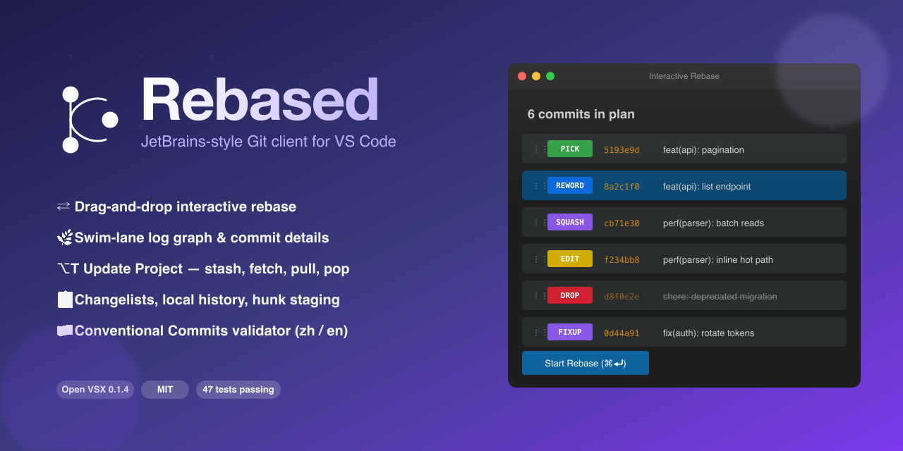

## 一图看懂

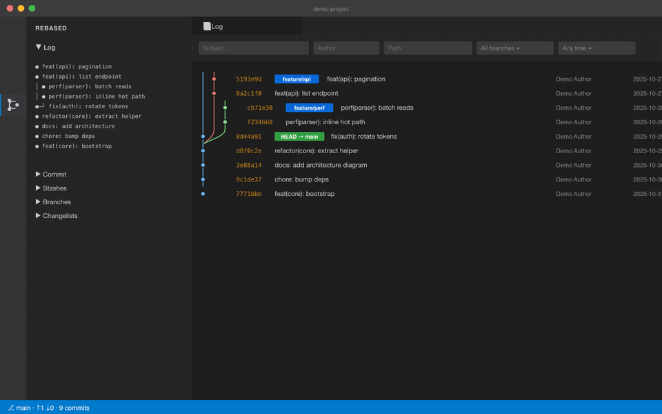

---

## 亮点

### 拖拽式交互 rebase

打开任意 `git-rebase-todo`（例如
`GIT_SEQUENCE_EDITOR="code --wait" git rebase -i HEAD~5`），会进入一个 Webview：
拖动行调整顺序，单击循环切换动作（pick → reword → edit → squash → fixup → drop），
⌘⏎ 保存并继续。

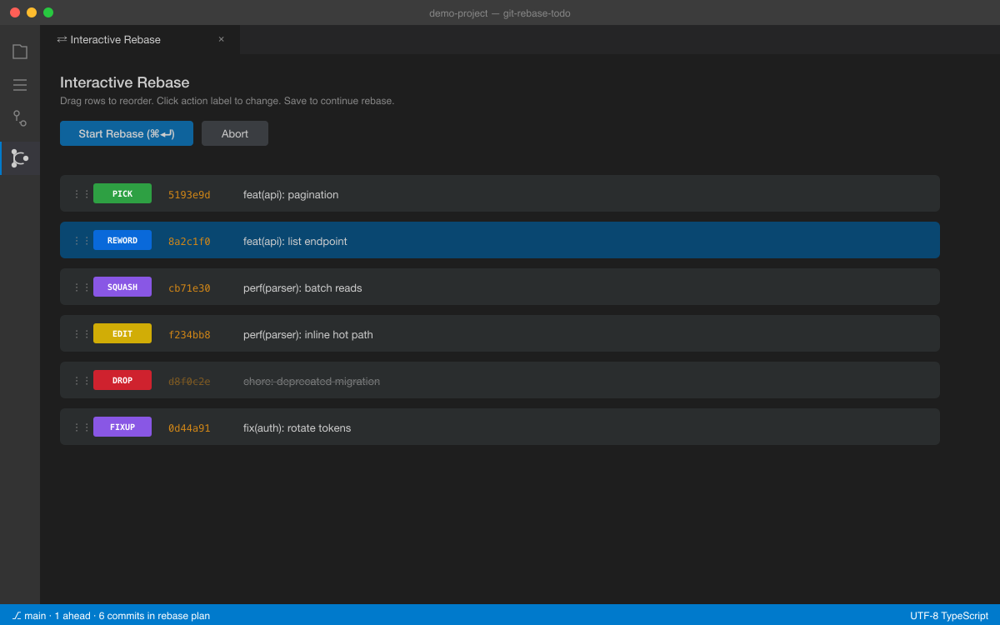

### 带虚拟滚动的提交图

按分支组织的泳道图、彩色 ref 标签、置顶过滤工具栏（subject / author / path /
branch / since）。一万条提交也能流畅滚动。

### 提交详情侧边面板

在提交图里点击任意提交，右侧展开侧边面板：subject、body、refs、parents，以及
可点击的文件列表（+ / − 行数）—— 每个文件通过 VS Code 内置 diff 编辑器与父提交
对比。

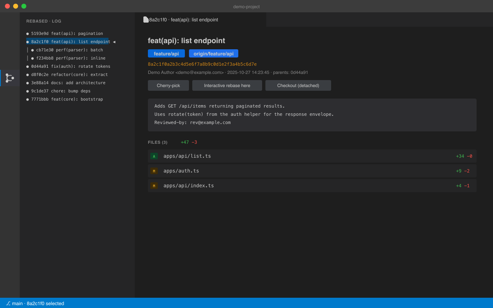

### Hunk 级暂存

每个文件按复选框逐块暂存 —— 后台用 `git apply --cached` 对选中行构造最小补丁。

### Conventional Commits 实时校验

提交输入框上方实时显示 type/scope/BREAKING 标签，状态栏标识
✓ 通过 / ⚠ 警告 / ✕ 格式错误。或者用 5 步的 **Commit Wizard**（⌘⌥C） ——
scope 自动从仓库历史补全。

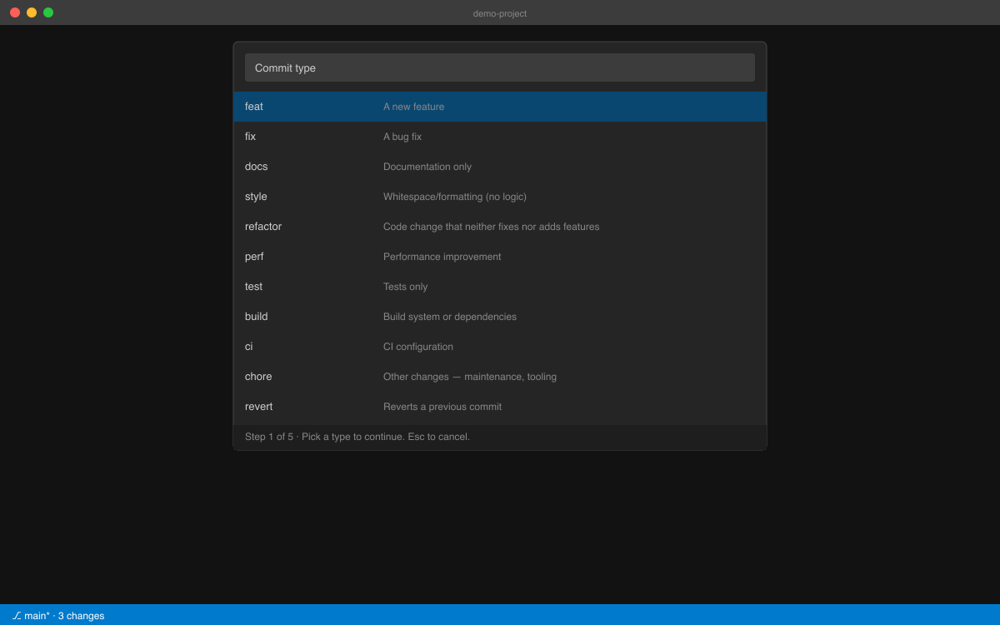

### 整文件 blame 侧栏

按 <kbd>⌘⌥B</kbd> 切换。每行在左侧栏显示 commit hash · author · 年龄；
来自同一提交的连续行会折叠，只在第一行标注。悬停标注可查看提交消息，并提供
一键 "Show commit" 跳转。

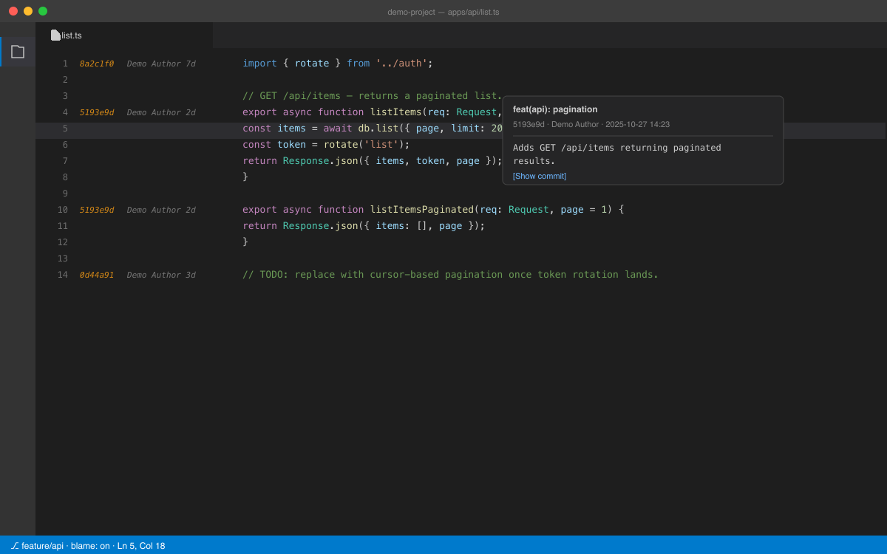

### 本地历史

每次保存自动生成快照写入 `globalStorage`。可浏览、与当前对比、或恢复 ——
完全独立于 Git，所以未提交的工作也能找回。

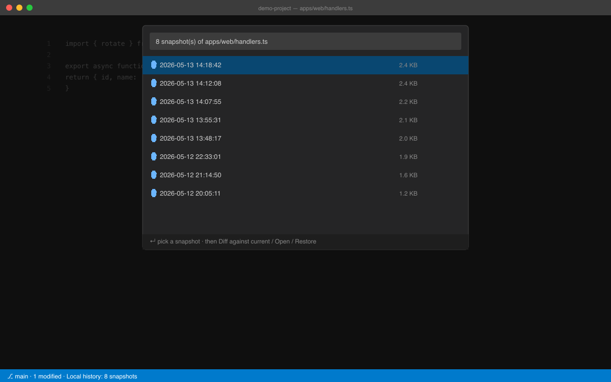

### 冲突解决面板

进入冲突状态（merge / rebase / stash-pop / 孤儿 unmerged）时，会出现一个
JetBrains 风格的面板，列出所有冲突文件并提供每个文件的操作 ——
*采用我方*（--ours）、*采用对方*（--theirs）、*合并…*（三向合并编辑器）、*重置*。
底部根据当前操作切换 finalize 按钮（标记已解决 / 继续 rebase / 丢弃 stash）。

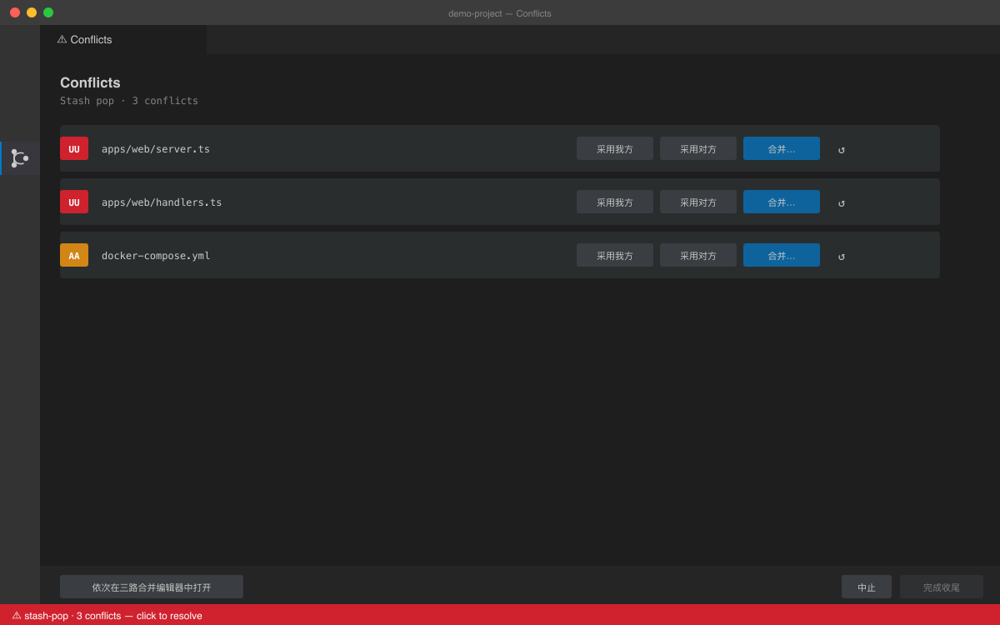

### 更改列表（Changelists）

JetBrains 风格的命名分组，把工作区路径归到不同 changelist。
临时修复可以单独成组、单独提交，不会带上无关改动。

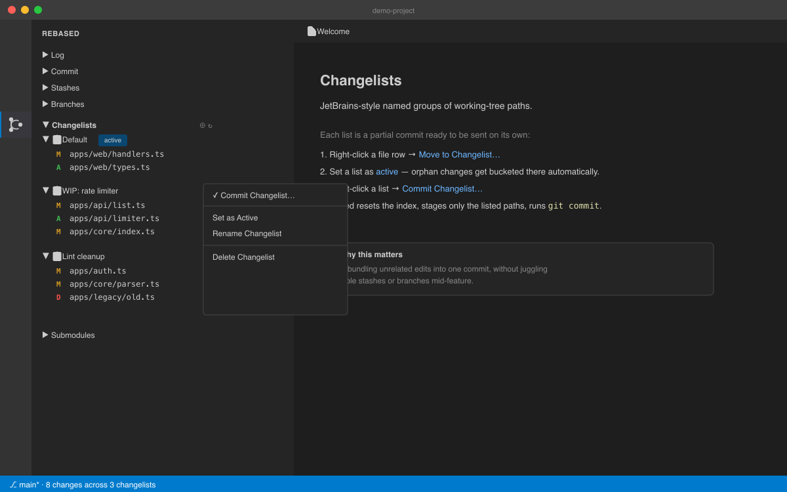

### 分支视图：直接右键的 JetBrains 式动作

侧栏的 **Branches** 树按本地 / 远端两组列出所有分支，把 JetBrains 弹出菜单里
的全部动作直接挂到每一行的右键菜单上，不再需要先开 QuickPick 选分支。点击
分支节点会打开底部 Log 面板并按该分支过滤提交（单击或双击触发由
`workbench.list.openMode` 决定）。

按分支类型显示对应菜单：

- **当前分支** — 从此处新建分支 · 重命名 · 推送（设置上游） · 强制推送（with-lease） · 复制分支名
- **本地非当前** — Checkout · 合并到当前 · 把当前变基到此 · 与当前对比 ·
  从此处新建分支 · 重命名 · 推送 · 强制推送 · 复制分支名 · 重置当前到这里 · 删除
- **远端**（`origin/…`） — Checkout · 合并 · 变基 · 对比 · 从此处新建分支 ·
  获取此分支 · 复制分支名 · 重置当前到这里 · 在远端删除

破坏性操作（强制推送、硬重置、在远端删除）走模态二次确认；merge / rebase
在工作区脏时自动提供"贮藏后重试"。

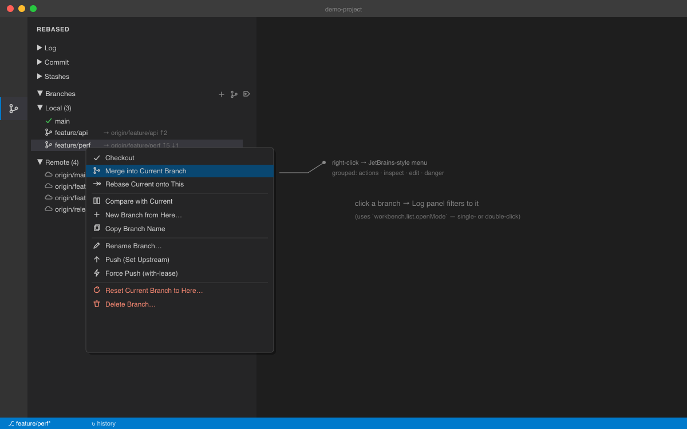

### 跟随状态的状态栏

颜色和内容随仓库状态变化 —— clean（蓝色）、dirty（蓝色 + changelist 名）、
conflict（红色 + 冲突文件数）。点击可创建分支。

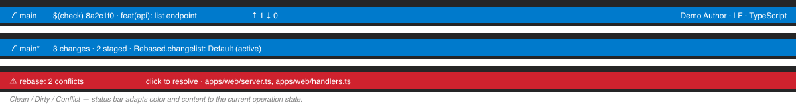

### 子模块视图

按 `git submodule status` 的前缀映射每个子模块的状态：已同步、不同步、未初始化、
冲突。标题栏提供 init / update / sync 动作。

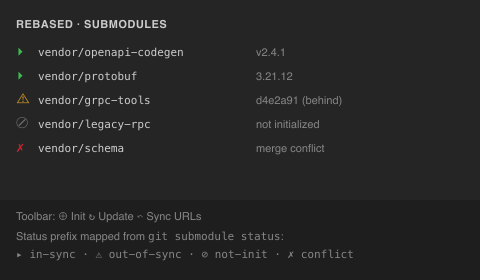

---

## 完整功能列表

| 类别 | 功能 |
|---|---|
| **Rebase** | 拖拽编辑器 · ⌘⏎ 保存 · 脏工作区时自动 stash |
| **Log** | 提交图 · 虚拟滚动 · 5 字段过滤 · refs · 右键菜单（rebase / cherry-pick / checkout） |
| **Commit** | 暂存 / 取消暂存 · hunk 级暂存 · amend · changelists · CC 校验 · wizard |
| **Branches** | 侧栏树 + JetBrains 风右键菜单（checkout · merge · rebase · 对比 · 重命名 · push · 强制推送 · fetch · 重置 · 删除 · 复制名） · 点击即打开 Log · QuickPick（⌘⇧B） |
| **History** | 提交详情 · 文件历史（`--follow`） · 对比分支 · 提交搜索（6 种模式） |
| **Blame** | 当前行内联 · 整文件侧栏（⌘⌥B） · 悬停查看提交 |
| **Stash** | 树状视图 · apply / pop / drop · 脏工作区时自动 stash 再重试 |
| **Tags** | 创建 lightweight / annotated · push · 删除本地 / 远端 |
| **Remotes** | 列表 · 添加 · prune fetch · 重命名 · 改 URL · 删除 · 浏览器打开 |
| **Push/Pull** | 预览提交 · merge / rebase / fetch-only · force-with-lease |
| **Conflicts** | 状态栏标记 · QuickPick → 三向合并编辑器 · 继续 / 中止 |
| **Reflog** | 浏览 · checkout · reset（soft/mixed/hard） · cherry-pick |
| **Submodules** | 树状视图 · init · update · sync |
| **本地历史** | 自动快照 · diff · 恢复（vsce-scheme） |
| **状态栏** | 当前分支 + 脏标记 |

---

## 命令

所有命令都在命令面板的 `Rebased:` 前缀下。

| 命令 | 默认快捷键 |
|---|---|
| Commit Wizard… | <kbd>⌘⌥C</kbd> |
| Branches… | <kbd>⌘⇧B</kbd> |
| Show File History | <kbd>⌘⌥H</kbd> |
| Toggle Full-File Blame | <kbd>⌘⌥B</kbd> |
| Search Commits… | <kbd>⌘⌥F</kbd> |
| Amend Last Commit | <kbd>⌘⌥K</kbd> |

`Cmd+Shift+P → Rebased:` 可发现全部命令。

---

## 配置

| 配置项 | 默认值 | 用途 |
|---|---|---|
| `rebased.log.maxCommits` | `2000` | 提交图每批加载的最大提交数 |
| `rebased.log.allBranches` | `true` | `git log` 是否带 `--all` |
| `rebased.rebase.autoStash` | `true` | 开始交互 rebase 前自动 stash |
| `rebased.gitPath` | `git` | git 可执行文件路径 |
| `rebased.blame.enabled` | `true` | 启用当前行内联 blame |
| `rebased.localHistory.maxPerFile` | `50` | 每文件保留的最大快照数 |
| `rebased.localHistory.maxBytes` | `1048576` | 超过此大小的文件跳过快照 |

---

## 安装

### 从 `.vsix`

```bash
git clone https://github.com/funchs/vscode-rebased
cd vscode-rebased
npm install
npm run build
npx @vscode/vsce package --allow-missing-repository
code --install-extension vscode-rebased-*.vsix
```

> 安装后，已经打开的 VS Code 窗口需要 **Developer: Reload Window**
> —— 扩展只在启动时加载一次。

### 开发模式（Extension Host）

```bash
npm install
npm run build
```

在 VS Code 中按 <kbd>F5</kbd> 启动加载本扩展的 Extension Development Host。

---

## 测试

```bash
npm test
```

会顺序跑 5 个测试套件：

```
smoke          6 项     纯解析器往返、真实仓库的图布局
integration    9 项     临时 git 仓库：重命名、冲突、reflog、update-project、边缘仓库
edge-cases     8 项     章鱼合并、重命名检测、EOF 标记、畸形输入
cc            12 项     Conventional Commits 解析 / 校验 / 格式化
notify        12 项     codicon 剥离、脏工作区启发、多行摘要、lock 检测、untracked 冲突解析
```

合计：**47 项通过**。

---

## 架构

```
src/
├── core/                 # git CLI 封装（spawn，无 shell）、仓库 watcher、CC 解析器、blame 解析器、通知助手
├── m0-rebase/            # git-rebase-todo 的 CustomTextEditorProvider
├── m1-log/               # WebviewViewProvider、泳道布局、详情面板、搜索、文件历史、对比
├── m2-commit/            # 暂存视图、hunks、更改列表、commit wizard
├── m3-stash/             # Stash / branches / tags / remotes / reflog / 冲突 / 子模块 picker
├── m4-settings/          # 内联 blame、侧栏 blame、本地历史、状态栏
└── webview/              # Webview 浏览器侧脚本（esbuild IIFE）
```

所有 UI 都是原生 TypeScript + HTML + VS Code 主题 CSS 变量，没有 React。
Webview 与扩展通过 `postMessage` 通信。

---

## 安全

- 所有 git 调用都走 `src/core/git.ts` 的 `runGit()`，使用 `spawn` + `shell: false` + argv 数组 —— 不存在 shell 注入。
- Webview 使用严格的 CSP，脚本由 nonce 控制。
- 文件内容渲染到 DOM 时使用 `textContent`，从不用 `innerHTML` 写入不可信字符串。

---

## 路线图

- 子模块相对父提交的 diff
- PR 集成（GitHub 通过 `gh` CLI）
- 提交图 subject 列的语义高亮（Conventional Commits 类型标签）
- 性能：持久化 log 索引，10 万提交的仓库也能瞬时打开

## 许可证

[MIT](LICENSE)
